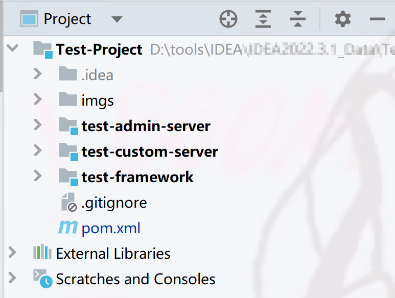

<p align="center">
    <a href="" target="_blank">
      
    </a>
</p>
<h1 align="center">SpringBoot-Kai-Project-cli</h1>
<p align="center"><strong>Kaiの快速开发SpringBoot项目的脚手架。<br><em>持续更新中～</em></strong></p>
<div align="center">
    <a href="https://github.com/AlfonsoKevin/Kai-Project"></a>
    <a href="https://github.com/AlfonsoKevin/Kai-Project"></a>
</div>


[中文|[English](./other-docs/README-EN.md)]

## 介绍

---

基于SpringBoot的快速开发的模板，致力于快速上手开发SpringBoot项目

- 采用Maven多模块化的架构模式
- 引入常用的依赖，方便快速上手开发
- 目录结构清晰，可维护性强


## 目录结构&设计🚀

---


```txt
├─📄 .gitignore------------------------------------------ # 防止git提交的文件
├─📁 kai-admin-server------------------------------------ # 管理端
├─📁 kai-custom-server----------------------------------- # C端
│ ├─📄 pom.xml------------------------------------------- # C端的依赖
│ └─📁 src
│   ├─📁 main
│   │ ├─📁 java
│   │ │ └─📁 com
│   │ │   └─📁 kaikai
│   │ │     └─📁 kproject
│   │ │       └─📁 custom
│   │ │         ├─📁 chat-------------------------------- # xx业务/模块(可修改)
│   │ │         ├─📁 common------------------------------ # 当前C端下通用的组件
│   │ │         │ ├─📁 config---------------------------- # Bean的配置管理
│   │ │         │ ├─📁 event----------------------------- # Spring事件监听
│   │ │         │ │ └─📁 listener------------------------ # 监听器
│   │ │         │ └─📁 intercepter----------------------- # 拦截器
│   │ │         ├─📄 KaiProjectCustomApplication.java
│   │ │         └─📁 user-------------------------------- # xx业务（以用户模块为例）
│   │ │           ├─📁 controller------------------------ # 控制层
│   │ │           ├─📁 dao------------------------------- # 封装的持久层
│   │ │           ├─📁 domain---------------------------- # 实体
│   │ │           │ ├─📁 dto----------------------------- # 面向service业务处理
│   │ │           │ ├─📁 entity-------------------------- # 实体
│   │ │           │ └─📁 vo------------------------------ # 前端的出入参
│   │ │           ├─📁 enums----------------------------- # 当前模块下的枚举类
│   │ │           ├─📁 mapper---------------------------- # mapper层
│   │ │           └─📁 service--------------------------- # 业务层
│   │ │             ├─📁 adapter------------------------- # 适配器，转换出入参的
│   │ │             └─📁 cache--------------------------- # 收口管理当前模块下的缓存
│   │ └─📁 resources
│   │   ├─📄 application-test.properties----------------- # 测试环境
│   │   └─📄 application.yml----------------------------- # 配置文件，多环境配置
│   └─📁 test-------------------------------------------- # 测试模块
│     └─📁 java
├─📁 kai-framework--------------------------------------- # 存放通用工具的
│ ├─📁 kai-common---------------------------------------- # 公共工具
│ │ ├─📄 pom.xml----------------------------------------- # 公共工具的依赖
│ │ └─📁 src
│ │   ├─📁 main
│ │   │ ├─📁 java
│ │   │ │ └─📁 com
│ │   │ │   └─📁 kaikai
│ │   │ │     └─📁 kproject
│ │   │ │       ├─📁 cache------------------------------- # 通用的缓存模块
│ │   │ │       └─📁 utils------------------------------- # 通用的工具类
│ │   │ └─📁 resources
│ │   └─📁 test
│ └─📄 pom.xml
└─📄 pom.xml--------------------------------------------- # 做依赖版本管理的父工程
```


### 详细介绍💻

分享我自己的多模块搭建模式，项目名以`Kai-Project`为例

整个项目主要有三部分：

`kai-admin-server`：提供管理端服务的包。引入`kai-common`模块的依赖

`kai-custom-server`：专门负责xx业务，如果是个人开发的话，可以将B，C端合并，改名为`name-xxx-server`，就是负责xxx的业务。引入`kai-common`模块的依赖

`kai-framework`：提供微服务的通用工具的包，里面可以有不同的模块，比如说

- `kai-common`：提供通用模块的包，里面提供通用的工具类，同时引入通用的依赖。供其他部分使用。
- `kai-oss-starter`：举例，可以有项目的分布式存储，日志打印框架都在这里创建。哪个端需要使用就直接引入
- `...`

`Kai-Project`只用于做父pom，管理依赖版本的。比如

```xml
   
<properties>
    <jsoup.version>1.15.3</jsoup.version>
</properties>

<dependencyManagement>
    <dependencies>
        <dependency>
            <groupId>org.jsoup</groupId>
            <artifactId>jsoup</artifactId>
            <version>${jsoup.version}</version>
        </dependency>
    </dependencies>
</dependencyManagement>

```


| Dependencies | Version      |
| ------------ | ------------ |
| SpringBoot   | 2.6.7        |
| JDK          | 8            |
| MyBatis      | 3.5.10       |
| Mybatis-Plus | 3.4.1        |
| MySQL        | 8.0.29       |
| Hutool       | 5.8.18       |
| Lombok       | 1.18.20      |
| Netty        | 4.1.76.Final |
| Swagger      | 3.0.0        |
| Rocketmq     | 2.2.2        |
| Jwt          | 3.19.0       |
| Spring-test  | 5.3.19       |
| Minio        | 8.4.5        |
| ...          | ...          |

gitignore中隐藏了sql文件，还有application-prod.yml，可以自行创建。


### 食用指南✨

> 先决条件：
>
> - JDK8+
> - Maven3.0+

【方案一】

[正确打开方式](./other-docs/create_by_maven.md)

你可以不使用命令行的方式来创建，可以自行搜索IDEA中添加Add Archetype的形式。

【方案二】手动修改

你可以拉取下代码任意进行修改，修改为你想要的项目的名字。

注意修改顺序：

假设你想要修改为`Test-Project`,项目里面是`test-custom-server`诸如此类的。

1. 将项目clone下来，然后进行直接文件改名
2. 删除`.idea`文件，`.idea`文件保留的是原先项目的信息
3. (上传的时候ignore了`.iml`,`target`，如果有，请删除)创建想要的sql文件夹。
4. 进入到maven中，将原先项目名使用全局搜索 + 全局替换`（CTRL + SHFIT + F ， CTRL + SHFIT + R)`。从父工程开始，和你的第一步修改的名字对应，最简单的方式是只修改`artifactId`的部分。
5. 以此类推，修改两个BC端的子工程，如果你想要合并，那就直接删除一个就行。然后是`framework`部分中管理的所有工具包，然后进入`common`包下修改。
6. `rm -rf .git`删除git文件之后，自己自建仓库。
7. 然后将所有的`.gitkeep`文件删除即可，是为了保留项目的目录结构
8. 如果想要快速入门，还需要稍微改一下配置文件。删去暂时不用的配置，比如说Redis的，RocketMq的诸如此类的配置。
9. 如果要修改`src`下面的文件夹，直接修改即可，要注意与启动类中的文件路径配置保持一致。
10. 重新加载Maven，看看哪里还有点不太对的。

如下



如果喜欢的话，别忘了点个 ⭐，感谢🥰

---

### 修改 ⚡

2024/11/21

- 上传到maven中央仓库
- 修改了使用指南，简化创建项目

2024/11/20

- 修改了`custom-server`下两个`SpringBootApplication`问题
- 调整`SpringBootApplication`,`application.yml`,`application.properties`默认值的问题
- 确保对应主入口的包路径是可以自定义的。

2024/11/18 

- 新增了用mvn的形式构建项目可见[正确打开方式](./other-docs/create_by_maven.md)
- 注释了common包下的`Redisson,Redis,RocketMq`相关依赖，方便启动，后续有使用再取消注释即可
- 修改了配置文件，删除了多余的`yml`部分，自定义更强，牺牲了全面的yml结构，需要使用者自行去**查找补充**；
- 使得clone下来代码，只要有正确的*数据库名*和*密码*，就可以**立马启动**。
- 新增`application-all.properties`之前的所有参数在这里

### 注意事项👂

- `.gitkeep` 的作用：只是一个约定俗成的文件名，为了展示项目的目录结构，这个文件夹是故意保留的，使用时候直接删除。
- 本项目仅供学习和参考使用，未经授权请勿用于商业目的。
- 欢迎贡献代码或者提出建议，您可以通过提出 Issue 或者 Pull Request 的方式参与到项目中来。

## 参与贡献

如果您对项目有任何建议或想要贡献代码，欢迎提交 Issue 或 Pull Request。我们期待您的参与，共同完善和改进项目！

---

感谢您对该项目的关注和支持！🕵️‍♀️